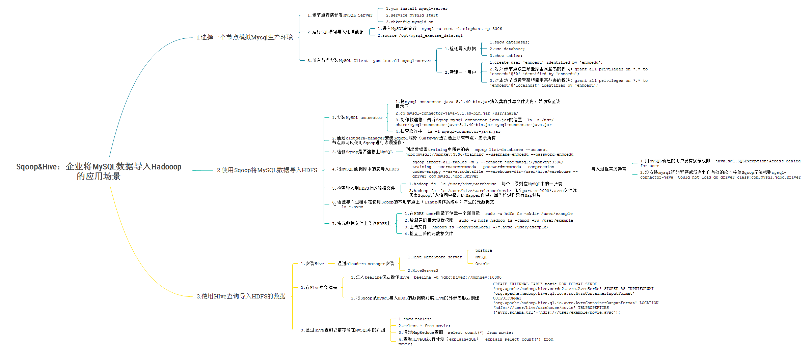

# <a name="cloudera_top">Cloudera大数据入门</a>

### By Gary
---
# Index：
### <a href="#chapter1">1.</a>
### <a href="#chapter2">2.</a>
### <a href="#chapter3">3.</a>
### <a href="#chapter4">4.</a>
### <a href="#chapter5">5.</a>
### <a href="#chapter6">6.</a>
### <a href="#chapter7">7.</a>

---
# <a name="chapter1">1.导论&Linux</a>

---
# <a name="chapter2">2.搭建Cloudera Hadoop集群</a>

---
# <a name="chapter4">4.使用MapReduce进行词频分析</a>

---
# <a name="chapter5">5.使用Flume把日志文件导入HDFS</a>

---
# <a name="chapter6">6.Sqoop&Hive</a>

---
# <a name="chapter7">7.使用Impala查询数据</a>

---
# <a name="chapter8">8.HBase</a>

---
# <a name="chapter9">9.版本更新</a>

---
# <a name="chapter9">10.Spark MLlib</a>

---