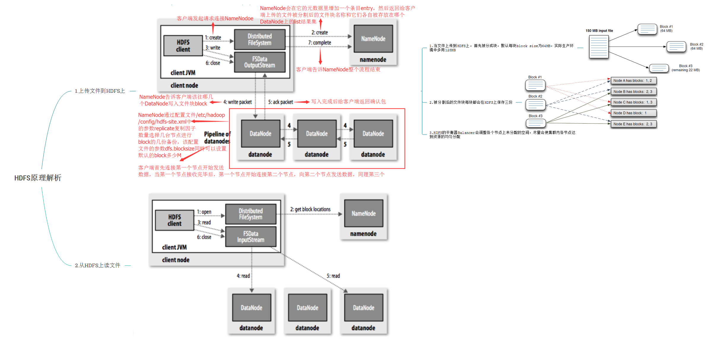
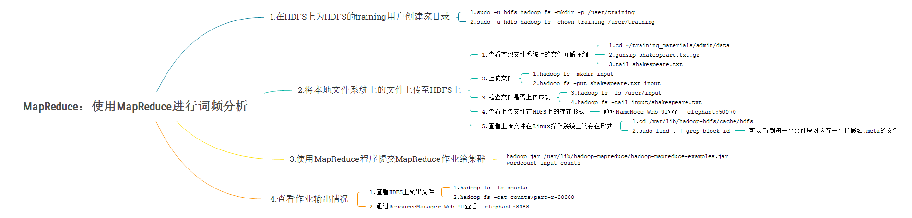
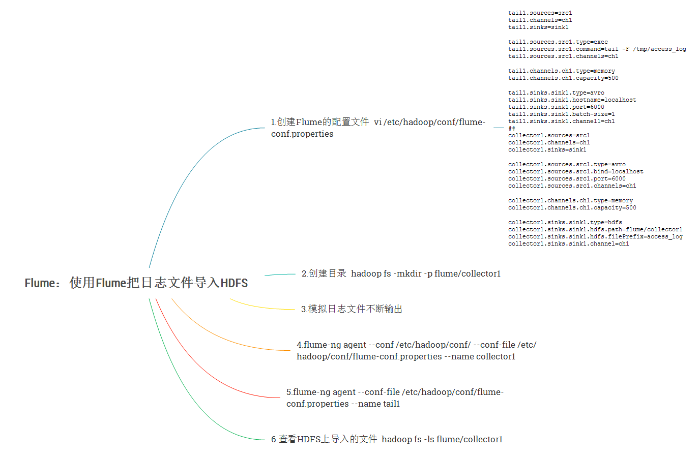

# <a name="cloudera_top">Cloudera大数据入门</a>

### By Gary
---
# Index：
### <a href="#chapter1">1.导论&Linux</a>
### <a href="#chapter2">2.搭建Cloudera Hadoop集群</a>
### <a href="#chapter3">3.YARN&HDFS</a>
### <a href="#chapter4">4.MapReduce</a>
### <a href="#chapter5">5.Flume</a>
### <a href="#chapter6">6.Sqoop&Hive</a>
### <a href="#chapter7">7.Impala</a>
### <a href="#chapter8">8.HBase</a>
### <a href="#chapter9">9.Spark MLlib</a>
### <a href="#chapter10">10.版本更新</a>

---
# <a name="chapter1">1.导论&Linux</a>

---
# <a name="chapter2">2.搭建Cloudera Hadoop集群</a>

---
# <a name="chapter3">3.YARN&HDFS</a>

---
# <a name="chapter4">4.MapReduce</a>

---
# <a name="chapter5">5.Flume</a>

---
# <a name="chapter6">6.Sqoop&Hive</a>

---
# <a name="chapter7">7.Impala</a>

---
# <a name="chapter8">8.HBase</a>

---
# <a name="chapter9">9.Spark MLlib</a>

---
# <a name="chapter10">10.版本更新</a>

---