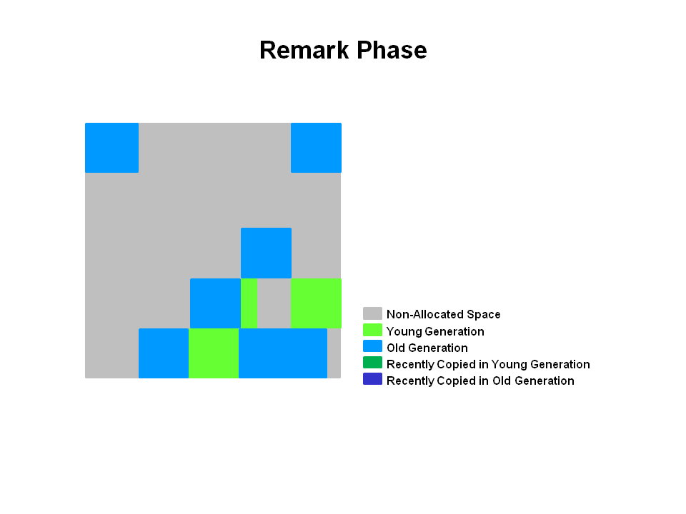

# G1垃圾回收器入门
### <a href="http://www.oracle.com/webfolder/technetwork/tutorials/obe/java/G1GettingStarted/index.html">翻译自Oraclle官方文档</a>
### By Gary

---
## Index:
### 1.概述
### 2.G1垃圾回收器
### 3.使用CMS查看GC
### 4.一步一步G1垃圾回收器
### 5.命令行选项和最佳实践
### 6.用G1记录GC

---
# 1.概述
## 目的
### 本教程介绍了如何使用G1垃圾回收器以及如何与Hotspot JVM一起使用的基础知识。您将了解G1回收器在内部的功能，使用G1的关键命令行开关以及用于记录其操作的选项。

## 介绍
### 本OBE涵盖了Java虚拟机（JVM）G1垃圾回收（GC）的基础知识。在OBE的第一部分中，提供了JVM的概述以及对垃圾回收和性能的介绍。接下来学生将获得有关CMS回收器如何与Hotspot JVM一起使用的评论。接下来，一步一步地指导在使用带有Hotspot JVM的G1垃圾回收时垃圾回收的工作原理。接下来，提供了一个部分，涵盖G1垃圾回收器提供的Garbage Collection命令行选项。最后，您将了解与G1回收器一起使用的日志记录选项。

---
# 2.G1垃圾回收器
### 垃圾回收器（G1）是一种服务器式垃圾回收器，针对具有大量内存的多处理器机器。它以高概率满足垃圾回收（GC）暂停时间目标，同时实现高吞吐量。Oracle JDK 7更新4及更高版本完全支持G1垃圾回收器。G1回收器专为以下应用而设计：
- 可以与CMS回收器等应用程序线程同时运行。
- 压缩空闲空间，无长时间的GC停顿时间。
- 需要更可预测的GC暂停持续时间。
- 不想牺牲大量的吞吐量性能。
- 不需要更大的Java堆。
### G1计划作为并行标记扫描回收器（CMS）的长期替代品。将G1与CMS进行比较，存在差异，使G1成为更好的解决方案。一个区别是G1是一个压缩回收器。G1压缩，足以完全避免使用细粒度的自由列表进行分配，而是依赖于区域。这大大简化了回收器的部分，并且大部分消除了潜在的碎片问题。此外，G1提供比CMS回收器更可预测的垃圾回收暂停，并允许用户指定所需的暂停目标。

## G1操作概述
### 老的垃圾回收器（串行，并行，CMS）都将堆结构分为三个部分：年轻代，老年代和固定内存大小的永久代。

### 所有内存对象最后都在这三个部分之一中。G1回收器采取不同的方法。

### 堆被分成一组相等大小的堆区，每个区都是连续的虚拟内存范围。某些区域集与老的回收器分配的角色相同（eden，幸存区，老年代），但是它们的大小不一样。这提供了更大的内存使用灵活性。
### 执行垃圾回收时，G1以类似于CMS回收器的方式运行。G1执行并发的全局标记阶段来确定整个堆中对象的活动性。标记阶段完成后，G1知道哪些区域大部分是空的。它首先在这些地区回收，这通常产生大量的可用空间。这就是为什么垃圾回收方法叫做G1。顾名思义，G1将其回收和压缩活动区中在可能充满可回收对象的堆的区域，也就是垃圾。G1使用暂停预测模型来满足用户定义的暂停时间目标，并根据指定的暂停时间目标选择要回收的区域数量。
### 由G1认定为成熟的区域是通过疏散内存回收垃圾。G1将对象从堆的一个或多个区域复制到堆上的单个区域，并且在此过程中，压缩和释放内存。这种疏散内存在多处理器上并行执行，以减少暂停时间并提高吞吐量。因此，对于每个垃圾回收，G1连续地减少碎片，在用户定义的暂停时间内工作。这超出了以前的两种方法的能力。CMS（并发标记扫描）垃圾回收器不执行压缩。ParallelOld垃圾回收仅执行整堆压缩，这导致相当多的暂停时间。
### 重要的是要注意，G1不是一个实时的回收器。它以高概率符合设定的暂停时间目标，但不能绝对确定。根据以前收集的数据，G1估计可以在用户指定的目标时间内回收多少个区域。因此，回收器具有回收区域成本的相当准确的模型，并且使用该模型来确定在暂停时间目标期间回收哪些和多少区域。
### 注意：G1同时（与应用程序线程一起运行，例如，细化，标记，清除）和并行（多线程，例如停止世界）阶段。完整的垃圾回收仍然是单线程的，但是如果正确调整，您的应用程序应避免使用full GC。

## G1踪迹
### 如果从ParallelOldGC或CMS回器迁移到G1，则可能会看到更大的JVM进程大小。这主要与“accounting”数据结构相关，如Remembered Sets和Collection Sets。
### Remembered Sets或RSets跟踪对象引用到给定的区域。堆中每个区域有一个RSet。RSet可以并行和独立地回收一个区域。RSets的整体踪迹影响小于5％。
### Collection Sets或CSets将在GC中回收的一组区域。GC中的所有实时数据在GC期间疏散（复制/移动）。一组地区可以是Eden，幸存区和/或老年代。CSets对JVM的大小影响不到1％。

## 推荐用于G1的用例
### G1的第一个重点是为运行应用程序的用户提供一个解决方案，这些应用程序需要大量的具有有限GC延迟的大堆 这意味着大约6GB或更大的堆大小，以及稳定和可预测的暂停时间低于0.5秒。
### 如果应用程序具有一个或多个以下特征，则使用CMS或ParallelOldGC垃圾回收器运行的应用程序将有利于切换到G1。
- Full GC持续时间太长或太频繁。
- 对象分配率或变迁率差异很大。
- 不期望的长期回收或压缩暂停（超过0.5至1秒）
### 注意：如果您正在使用CMS或ParallelOldGC，并且您的应用程序没有经历长时间的垃圾回收中止，则保持与您的当前回收器是很好的。更改为G1回收器不是使用最新JDK的要求。

---
# 3.使用CMS查看GC
## 回顾分代GC和CMS
### 并发标记扫描（CMS）回收器（也称为并发低暂停回收器）回收老年代。它尝试通过与应用程序线程同时执行大部分垃圾回收工作来最小化由于垃圾回收引起的暂停。通常，并发的低暂停回收器不会复制或压缩活动对象。在不移动活动对象的情况下完成垃圾回收。如果碎片成为问题，请分配更大的堆。
## CMS回收阶段
### CMS回收器在旧版本的堆上执行以下阶段：

<table><thead><tr><td>Phase</td><td>Description</td></tr></thead><tbody><tr><td>（1）初始标记
（停止世界事件）</td><td>老年代的对象被“标记”为可触及，包括可能从年轻代到达的对象。暂停时间通常相对于次要回收暂停时间短</td></tr><tr><td>（2）并发标记</td><td>在Java应用程序线程正在执行的同时遍历可达对象的老年代对象图。从标记的对象开始扫描，并将从根部到达的所有对象进行传递。突发器在并发阶段2,3和5期间执行，并且在这些阶段（包括升级对象）期间在CMS代中分配的任何对象都将立即标记为存活。</td></tr><tr><td>（3）备注
（停止世界事件）</td><td>查找并发标记阶段遗漏的对象，因为在并发回收器完成跟踪该对象后，Java应用程序线程会更新到对象。</td></tr><tr><td>（4）并发扫描</td><td>在标记阶段回收标识为不可达的对象。死对象的集合将对象的空间添加到空闲列表中以供以后分配。此时可能会发生死亡对象的聚结。请注意，活动对象不会移动。</td></tr><tr><td>（5）复位</td><td>通过清除数据结构准备下一个并发回收。</td></tr></tbody></table>

## 回顾垃圾回收步骤
### 接下来，我们一步一步查看CMS回收器操作。
### 1.CMS回收器堆结构
### 堆被分成三个空间。

### 年轻代分裂成Eden和两个幸存空间。老年代是一个连续的空间。对象集合完成。除非有full GC，否则不进行压缩。

### 2.年轻代GC如何在CMS中工作
### 年轻代是浅绿色，老年代是蓝色的。如果您的应用程序运行了一段时间，这可能是CMS的表现。对象分散在老年代。

### 使用CMS，老年代对象被释放到位。他们没有移动。空间不紧凑，除非有完整的GC。

### 3.年轻代回收
### 活动对象从Eden和幸存空间复制到另一个幸存空间。任何已达到老化阈值的老对象都会升为老年代。

### 4.年轻代GC后
### 在年轻代GC之后，Eden空间被清除，其中一个幸存空间被清除。

### 新提升的对象在图中以深蓝色显示。绿色的对象是幸存下来的一代尚未晋升为老年代的年轻代对象。

### 5.CMS老年代回收
### 两次停止世界事件发生：初始标记和备注。当老年代达到一定的入住率时，CMS被启动。

### （1）初始标记是一个短暂的暂停阶段，其中存在（可达到的）对象被标记。（2）并发标记在应用程序继续执行时查找活动对象。最后，在（3）备注阶段，发现在上一阶段（2）并发标记期间遗漏的对象。

### 6.老年代回收 - 并列扫描
### 在前一阶段没有标记的对象被释放到位。没有压缩。

### 注意：未标记的对象==死对象

### 7.老年代回收 - 清扫后
### 在（4）扫描阶段之后，你可以看到很多内存被释放。您还会注意到没有压缩已经完成。

### 最后，CMS回收器将通过（5）复位阶段，等待下一次达到GC阈值。

---
# 4.一步一步G1垃圾回收器
### G1回收器采用不同的方法分配堆。后续的图片逐步回顾了G1系统。

### 1.G1堆结构
### 堆是一个分为许多固定大小区域的内存区域。

### 区域大小由JVM在启动时选择。JVM通常针对2000个区域，大小从1到32Mb不等。

### 2.G1堆分配
### 实际上，这些区域被映射为Eden，幸存区和老年代空间的逻辑表示。

### 图片中的颜色显示哪个区域与哪个角色相关联。活动对象从一个区域撤出（即复制或移动）到另一个区域。区域被设计为与或不停止所有其他应用程序线程并行回收。
### 如图所示，这些区域可以分配到Eden，幸存区和老年代区域。另外还有第四类被称为Humongous区域的对象。 这些区域被设计为保持标准区域或更大尺寸的50％的对象。它们被存储为一组连续的区域。最后，最后一种类型的区域将是堆的未使用区域。
### 注意：在撰写本文时，回收humongous对象尚未被优化。因此，您应避免创建此大小的对象。

### 3.G1中的年轻代
### 堆被分为大约2000个区域。最小尺寸为1Mb，最大尺寸为32Mb。蓝色区域拥有老年代的对象，绿色区域拥有年轻代的对象。

### 请注意，这些区域不像老的垃圾回收器那样连续。

### 4.G1中年轻代的GC
### 活动对象被撤离（即复制或移动）到一个或多个幸存区域。如果满足老化阈值，某些对象将被升级到老年代区域。

### 这是一个停止世界（STW）的暂停。对于下一个年轻代的GC计算Eden大小和幸存区大小。保存Accounting信息以帮助计算大小。像暂停时间目标这样的事情被考虑在内。
### 这种方法使得非常容易调整区域大小，使其根据需要变得更大或更小。

### 5.G1年轻代GC的结束
### 活动对象已被撤离到幸存区或老年代。

### 最近升级的对象以深蓝色显示。幸存区用绿色。
### 总之，关于G1的年轻代可以说如下：
- 堆是单个内存空间分割成区域。
- 年轻代内存由一组非连续的区域组成。这使得在需要时可以轻松调整大小。
- 年轻代的垃圾回收，或年轻代GC是停止世界事件。所有应用程序线程都停止运行。
- 年轻代GC是使用多个线程并行完成的。
- 活动对象被复制到新的幸存区或老年代区。

## G1的老年代回收
### 像CMS回收器一样，G1回收器被设计为用于老年代对象的低暂停回收器。下表介绍了老年代的G1回收阶段。

## G1回收阶段 - 并发标记循环阶段
### G1回收器在老年代的堆上执行以下阶段。请注意，一些阶段是年轻代的回收部分。

<table><thead><tr><td>Phase</td><td>Description</td></tr></thead><tbody><tr><td>（1）初始标记
（停止世界事件）</td><td>这是停止世界事件。使用G1，它搭载在正常的年轻代GC上。标记幸存区域（根区域），它们可能引用了老年代中的对象。</td></tr><tr><td>（2）根区域扫描</td><td>扫描幸存区参考老年代。这在应用程序继续运行时发生。必须在发生年轻代的GC之前完成。</td></tr><tr><td>（3）并发标记</td><td>在整个堆中查找活动对象。这在应用程序运行时发生。这个阶段可以被年轻代垃圾回收中断。</td></tr><tr><td>（4）备注（停止世界事件）</td><td>在堆中完成活动对象的标记。使用一种名为snapshot-at-the-begin（SATB）的算法，该算法比CMS回收器中使用的算法快得多。</td></tr><tr><td>（5）清理（停止世界事件和并发）</td><td>
- 执行活动对象和完全自由区域的统计。（停止世界）
- 清理记忆集。（停止世界）
- 重置空区域并将其返回到空闲列表。（并发）</td></tr><tr><td>（*）复制（停止世界事件）</td><td>这些是停止世界暂停将活动对象撤离或复制到新的未使用区域。这可以用记录为[GC暂停（年轻）]的年轻代区域完成。或者作为[GC暂停（混合）]记录的年轻和老年代区域。</td></tr></tbody></table>

### G1老年代一步一步回收
### 通过这些阶段的定义，我们来看看它们如何与G1回收器中的老年代进行交互。
### 6.初始标记阶段
### 活动对象的初始标记搭载在年轻代的垃圾回收中。在日志中，这被称为GC暂停（年轻代）（初始标记）。

### 7.并行标记阶段
### 如果找到空区域（如“X”所示），则在备注阶段立即删除它们。此外，计算出确定活跃度的“accounting”信息。

### 8.备注阶段
### 空区域被删除和回收。现在，对所有区域计算区域活跃度。

### 9.复制/清理阶段
### G1选择“活跃度”最低的区域，可以最快回收的区域。那么这些区域就是和年轻代的GC同时回收。这在日志中被表示为[GC pause（mixed）]。 所以同时回收年轻代和老年代。

### 10.复制/清理阶段后
### 所选择的区域已被回收并压缩成如图所示的深蓝色区域和深绿色区域。

### 老年代GC概要
### 总而言之，我们可以提到关于老年代的G1垃圾回收的几个要点。
- 并行标记阶段
	> 在应用程序运行的同时计算活动信息。
	
	> 这种活动信息确定在撤离暂停期间哪些区域最适合回收。

	> 没有像CMS这样的扫荡阶段。
- 备注阶段
	> 使用快照开始（SATB）算法，这比CMS使用的快得多。
	
	> 完全空的区域被回收。
- 复制/清理阶段
	> 年轻代和老年代同时被回收。
	
	> 根据活动信息选择老年代。

---
# 5.命令行选项和最佳实践
### 在本节中，我们来看看G1的各种命令行选项。
## 基本命令行
### 使用G1回收器：-XX:+UseG1GC

## 基本的命令行开关
### -XX:+UseG1GC - 告诉JVM使用G1垃圾回收器。
### XX:MaxGCPauseMillis=200 - 设置最大GC暂停时间的目标。这是一个软目标，JVM将尽力实现。因此暂停时间的目标有时候不会得到满足。 默认值为200毫秒。
### -XX:InitiateHeapOccupancyPercent=45 - 开始并发GC循环的（整个）堆占用的百分比。G1使用它来触发并发的GC循环，基于整个堆的占用，而不仅仅是某一代。值为0表示“做恒定GC循环”。默认值为45（即45％满或占用）。

## 最佳实践
### 使用G1时，应遵循一些最佳实践。
### 不要设置年轻代的大小
### 使用G1回收器的默认行为，通过-Xmn插入显式设置年轻代的大小。
- G1将不再尊重回收的暂停时间目标。所以在本质上，设置年轻代的大小会阻止暂停时间的目标。
- G1不再能够根据需要扩大和收缩年轻代的空间。由于大小是固定的，所以不能改变大小。

## 响应时间指标
### 而不是使用平均响应时间（ART）作为度量来设置XX：MaxGCPauseMillis=N，请考虑设置满足90％或更长时间的目标的值。 这意味着90％的用户提出请求将不会超过目标的响应时间。请记住，暂停时间是一个目标，不能保证始终得到满足。

## 什么是疏散失败？
### 当幸存区GC和升级对象的GC期间，JVM用尽堆区时，会发生升级失败。堆不能扩展，因为它已经在最大。当通过空间溢出使用-XX:+PrintGCDetails时，这在GC日志中显示。这很昂贵！
- GC仍然必须继续，所以空间必须被释放。
- 未成功复制的对象必须升级到老年代。
- 必须重新生成CSet中区域的RSets的任何更新。
- 所有这些步骤都是昂贵的。

## 如何避免疏散失败
### 为避免疏散故障，请考虑以下选项。
- 增加堆大小
- 增加-XX:G1ReservePercent=n，默认值为10。
- 如果需要更多的“空间”，则G1将通过尝试离开备用内存来创建虚假的上限。
- 开始标记循环
- 使用-XX:ConcGCThreads=n选项增加标记线程的数量。

## G1 GC开关的完整列表
### 这是G1 GC开关的完整列表。请记住使用上述最佳做法。

<table><thead><tr><td>Option and Default Value</td><td>Description</td></tr></thead><tbody><tr><td>-XX:+UseG1GC</td><td>使用垃圾回收（G1）回收器</td></tr><tr><td>-XX:MaxGCPauseMillis=n</td><td>设置最大GC暂停时间的目标。这是一个软目标，JVM将尽力实现。</td></tr><tr><td>-XX:InitiatingHeapOccupancyPercent=n</td><td>启动并发GC循环的（整个）堆占用的百分比。它被GC使用，基于整个堆的占用而不仅仅是一代（例如，G1）触发并发GC循环。值为0表示“做恒定GC循环”。默认值为45。</td></tr><tr><td>-XX:NewRatio=n</td><td>年轻代/老年代大小比例。默认值为2。</td></tr><tr><td>-XX:SurvivorRatio=n</td><td>Eden/幸存空间大小的比例。默认值为8。</td></tr><tr><td>-XX:MaxTenuringThreshold=n</td><td>固定阈值的最大值。默认值为15。</td></tr><tr><td>-XX:ParallelGCThreads=n</td><td>设置在垃圾回收器的并行阶段使用的线程数。默认值随运行JVM的平台而异。</td></tr><tr><td>-XX:ConcGCThreads=n</td><td>并发垃圾回收器将使用的线程数。默认值随运行JVM的平台而异。</td></tr><tr><td>-XX:G1ReservePercent=n</td><td>设置保留为假上限的堆的数量，以减少升级失败的可能性。默认值是10。</td></tr><tr><td>-XX:G1HeapRegionSize=n</td><td>使用G1，Java堆被细分为均匀大小的区域。这设定了各个部分的大小。此参数的默认值根据堆大小的人体工程学确定。最小值为1Mb，最大值为32Mb。</td></tr></tbody></table>

---
# 6.用G1记录GC
### 我们需要解决的最后一个主题是使用日志信息来分析G1回收器的性能。本节简要介绍可用于回收数据的开关以及日志中打印的信息。

## 设置日志详细信息
### 您可以将细节设置为三个不同级别的细节。
### （1）-verbosegc（相当于-XX:+PrintGC）设置日志的细节级别。
### 示例：
    [GC pause (G1 Humongous Allocation) (young) (initial-mark) 24M- >21M(64M), 0.2349730 secs]
	[GC pause (G1 Evacuation Pause) (mixed) 66M->21M(236M), 0.1625268 secs]   
### （2）-XX:+PrintGCDetails将详细级别设置为更精细。选项显示以下信息：
- 每个阶段显示平均，最小和最大时间。
- 根扫描，RSet更新（已处理缓冲区信息），RSet扫描，对象复制，终止（尝试次数）。
- 还显示“其他”时间，例如花费在选择CSet，参考处理，引用排队和释放CSet的时间。
- 显示Eden，幸存区和总堆占用。
### 示例：
	[Ext Root Scanning (ms): Avg: 1.7 Min: 0.0 Max: 3.7 Diff: 3.7]
	[Eden: 818M(818M)->0B(714M) Survivors: 0B->104M Heap: 836M(4096M)->409M(4096M)]
### （3）-XX:+UnlockExperimentalVMOptions -XX:G1LogLevel=最好将细节级别设置为最佳。喜欢更细，但包括个人工作者的线程信息。
### 示例：
	[Ext Root Scanning (ms): 2.1 2.4 2.0 0.0
           Avg: 1.6 Min: 0.0 Max: 2.4 Diff: 2.3]
       [Update RS (ms):  0.4  0.2  0.4  0.0
           Avg: 0.2 Min: 0.0 Max: 0.4 Diff: 0.4]
           [Processed Buffers : 5 1 10 0
           Sum: 16, Avg: 4, Min: 0, Max: 10, Diff: 10]

## 确定时间
### 几个开关决定了GC日志中显示的时间。
### （1）-XX:+PrintGCTimeStamps - 显示自JVM启动以来的经过时间。
### 示例：
	 1.729: [GC pause (young) 46M->35M(1332M), 0.0310029 secs]
### （2）-XX:+PrintGCDateStamps - 为每个条目添加时间前缀。
### 示例：
	2012-05-02T11:16:32.057+0200: [GC pause (young) 46M->35M(1332M), 0.0317225 secs]

## 了解G1日志
### 要了解日志，本节使用实际GC日志输出定义了一些术语。以下示例显示了日志中的输出，以及您将在其中找到的术语和值的解释。
## G1日志术语索引
### 1.Parallel Time并行时间
### 示例：
	414.557: [GC pause (young), 0.03039600 secs] [Parallel Time: 22.9 ms]
	[GC Worker Start (ms): 7096.0 7096.0 7096.1 7096.1 706.1 7096.1 7096.1 7096.1 7096.2 7096.2 7096.2 7096.2
       Avg: 7096.1, Min: 7096.0, Max: 7096.2, Diff: 0.2]
### Parallel Time – 暂停的主要并行部分的总经过时间
### Worker Start – worker开始的时间戳
### 注意：日志在线程ID上排序，并且在每个条目上是一致的

### 2.External Root Scanning扫描外部根部
### 示例：
	[Ext Root Scanning (ms): 3.1 3.4 3.4 3.0 4.2 2.0 3.6 3.2 3.4 7.7 3.7 4.4
     Avg: 3.8, Min: 2.0, Max: 7.7, Diff: 5.7]
### External root scanning - 扫描外部根部所花费的时间（例如，指向堆的系统字典）

### 3.Update Remembered Set更新记忆集
### 示例：
	[Update RS (ms): 0.1 0.0 0.0 0.0 0.0 0.0 0.0 0.0 0.0 0.0 0.0 0.0 Avg: 0.0, Min: 0.0, Max: 0.1, Diff: 0.1]
   	[Processed Buffers : 26 0 0 0 0 0 0 0 0 0 0 0
    Sum: 26, Avg: 2, Min: 0, Max: 26, Diff: 26]
### Update Remembered Set - 必须更新在开始暂停之前完成但尚未被并发优化线程处理的任何缓冲区。时间取决于卡的密度。卡越多，需要的时间越长。

### 4.Scanning Remembered Sets扫描记忆集
### 示例：
	[Scan RS (ms): 0.4 0.2 0.1 0.3 0.0 0.0 0.1 0.2 0.0 0.1 0.0 0.0 Avg: 0.1, Min: 0.0, Max: 0.4, Diff: 0.3]F
### Scanning Remembered Sets - 查找指向回收集的指针。

### 5.Object Copy对象复制
### 示例：
	[Object Copy (ms): 16.7 16.7 16.7 16.9 16.0 18.1 16.5 16.8 16.7 12.3 16.4 15.7 Avg: 16.3, Min: 12.3, Max:  18.1, Diff: 5.8]
### Object copy – 每个线程用于复制和疏散对象的时间。

### 6.Termination Time终止时间
### 示例：
	[Termination (ms): 0.0 0.0 0.0 0.0 0.0 0.0 0.0 0.0 0.0 0.0 0.0
	0.0 Avg: 0.0, Min: 0.0, Max: 0.0, Diff: 0.0] [Termination Attempts : 1 1 1 1 1 1 1 1 1 1 1 1 Sum: 12, Avg: 1, Min: 1, Max: 1, Diff: 0]
### Termination time - 当工作线程完成其特定的一组对象进行复制和扫描时，它将进入终止协议。它寻找工作窃取，一旦完成了这项工作，它再次进入终止协议。终止企图计算所有企图窃取工作

### 7.GC Worker End GC工作结束
### 示例：
	[GC Worker End (ms): 7116.4 7116.3 7116.4 7116.3 7116.4 7116.3 7116.4 7116.4 7116.4 7116.4 7116.3 7116.3
    Avg: 7116.4, Min: 7116.3, Max: 7116.4, Diff:   0.1]
	[GC Worker (ms): 20.4 20.3 20.3 20.2 20.3 20.2 20.2 20.2 20.3 20.2 20.1 20.1
     Avg: 20.2, Min: 20.1, Max: 20.4, Diff: 0.3]
### GC worker end time – 单个GC工作停止时的时间戳。
### GC worker time – 单个GC工作线程花费的时间。

### 8.GC Worker Other GC其他工作
### 示例：
	[GC Worker Other (ms): 2.6 2.6 2.7 2.7 2.7 2.7 2.7 2.8 2.8 2.8 2.8 2.8
    Avg: 2.7, Min: 2.6, Max: 2.8, Diff: 0.2]
### GC worker other – 不能归因于前面列出的工作阶段的时间（对于每个GC线程）。应该相当低。在过去，我们已经看到了过高的价值，它们被归因于JVM其他部分的瓶颈（例如，代码缓存占用的增加）。

### 9.Clear CT
### 示例：
	[Clear CT: 0.6 ms]
### 用于清除RSet扫描元数据的卡表的时间

### 10.Other
### 示例：
	[Other: 6.8 ms]
### GC暂停的各种其他顺序阶段所花费的时间。

### 11.CSet
### 示例：
	[Choose CSet: 0.1 ms]
### 最后确定要回收的区域集合的时间。通常非常小；稍长时必须选择old。

### 12.Ref Proc
### 示例：
	[Ref Proc: 4.4 ms]
### 从GC的前几个阶段延迟处理软、弱等引用的时间。

### 13.Ref Enq
### 示例：
	[Ref Enq: 0.1 ms]
### 在待定列表中放置软、弱等引用的时间。

### 14.Free CSet
### 示例：
	[Free CSet: 2.0 ms]
### 时间花费了刚刚回收的一些区域，包括他们的记忆集。
